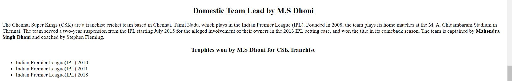

# Web_ICP2

## In this class I got to know about the tags of html and basics of css

The html tags learned in this class are

1. Headings
2. Paragraph
3. Image and video tags
4. Ordered Lists
5. Unordered Lists
6. In-line Elements
7. Block Elements

# Outputs

