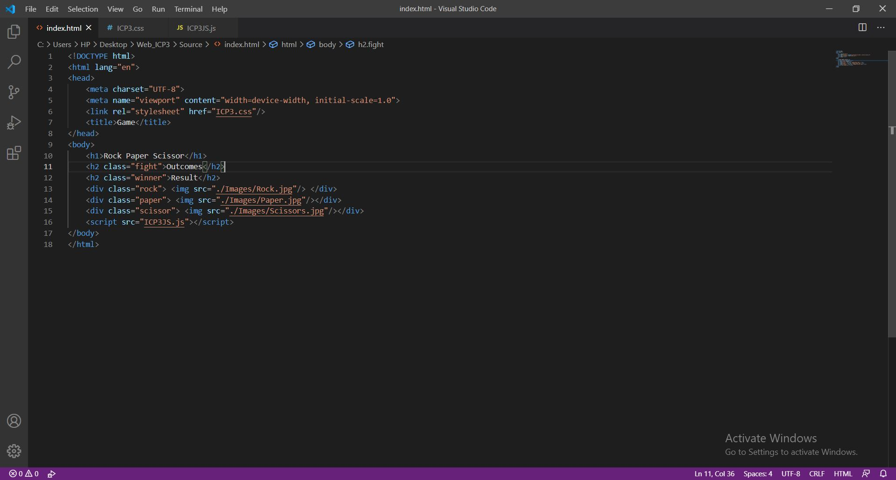

# Web_ICP3

## In this class I was introduced to Javascript, Grid layout in Bootstrap and basics of RWD

# Outputs

## Below are the outputs for the Game Rock_Paper_Scissor

1. The HTML page screenshot is attached below

2. Output of the HTML page screenshot is attached below

3. When user clicks on any button the winner will be declared as shown in below screenshot

.JPG)

## Below are the outputs for Responsive web design

1. Mobile view

2. Tablet view

3. Full Screen

