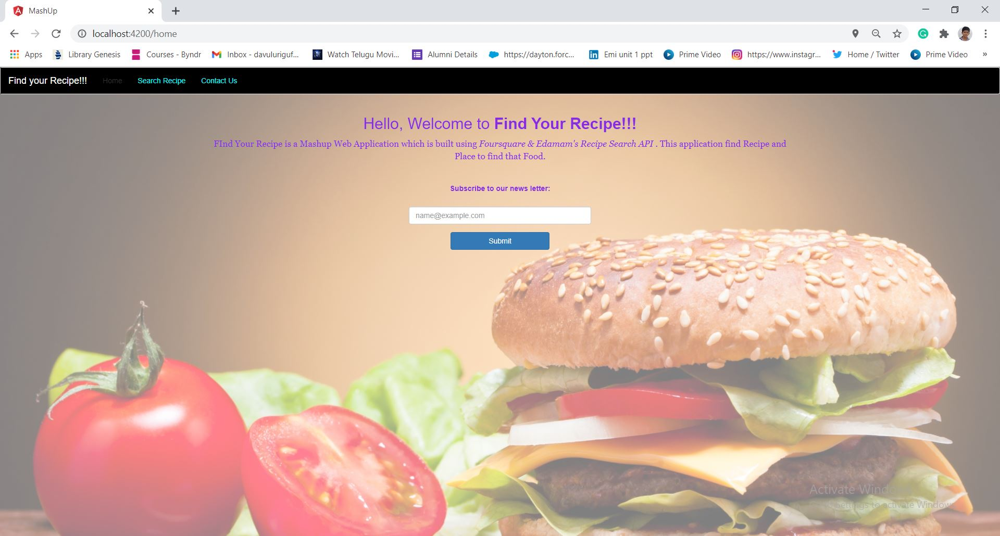
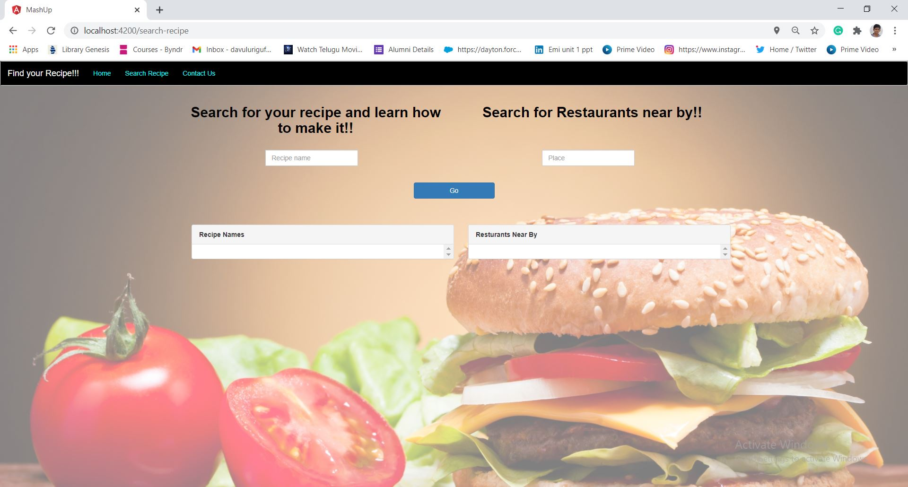
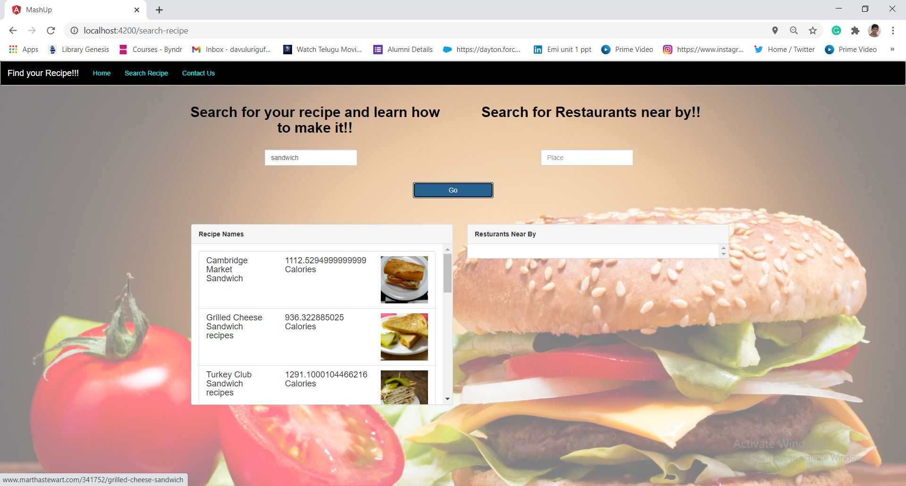
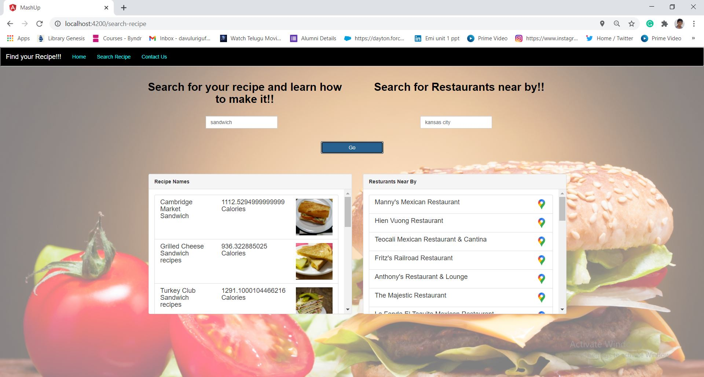

# Web ICP 6

In this ICP I made a search engine where any recipie with their preparaion link and location can be found by searching them in the search bar

# Basic Requirements of this ICP

1. Nodejs

2. Install angular cli by using the command. npm install -g @angular/cli

# Output

Final output is displayed below

When the Home page is opened we get this as output

When we click on search engine we get this as output

When we search an item we get the results for our search

When we search for the location we get the nearby locations with the food items at output

